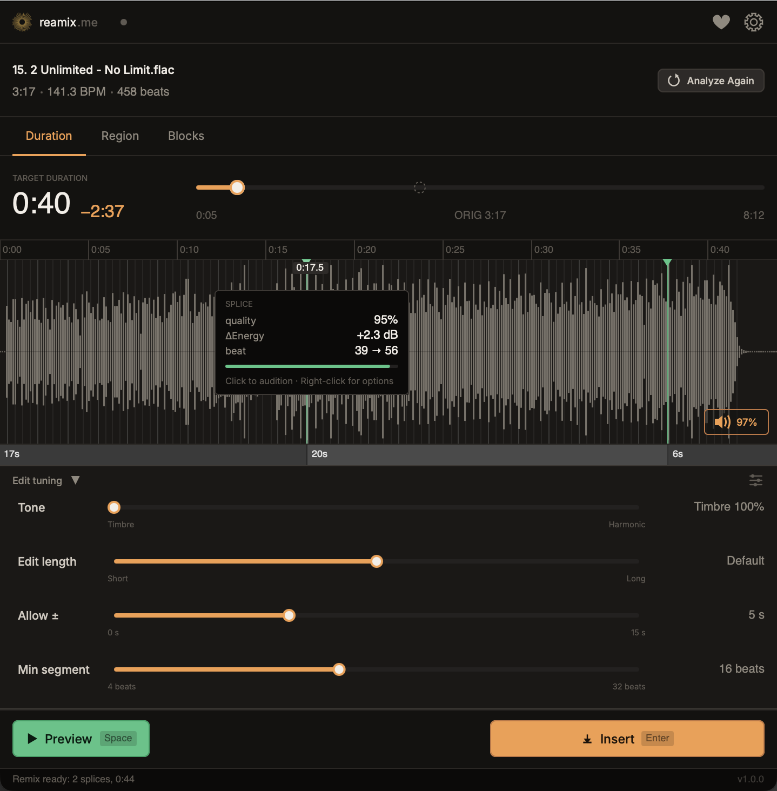

# reamix.me

[](LICENSE)
[]()
[]()
[]()

**Retarget any song to any length — without time-stretching.**

A native [REAPER](https://www.reaper.fm/) extension that finds where to splice and stitches a new version of your track at the duration you ask for.



The technique is **beat-aligned splicing**, not time-stretching: the algorithm finds pairs of beats where the splice is least likely to be heard as an edit — matched phase, matched chroma, matched energy, matched structural role — and stitches those splices into a path that hits the target duration.

**Quality goal: edits that go unnoticed in casual listening.** Results depend on genre and tempo — see [Scope + limitations](#scope--limitations) below for what works well and what doesn't.

## Three modes

| Mode | What it does | Status |
|------|--------------|--------|
| **Target Duration** | Set a duration; the algorithm picks the optimal splice path across the whole track. | Stable |
| **Region Remix** | Retarget only the REAPER time-selection; rest of the track untouched. | **Beta** |
| **Block Assembly** | Manually order sections (Intro → Chorus → Verse → Chorus → Outro); the algorithm optimizes only the splice at each junction. | **Beta** |

## Scope + limitations

reamix.me is tuned for music where beats land on a regular grid and structural sections (verse / chorus / bridge) are well-defined.

**Works best on**: pop, dance, EDM, house, hip-hop, pop-rock, and other beat-driven, predominantly mid-tempo material (~90–145 BPM). Validated against a multi-genre listening corpus.

**Mixed results on**: rock with extended freeform sections, ballads with rubato timing, jazz, classical, acoustic singer-songwriter material with sparse percussion.

**Not currently in scope**: drum'n'bass and other fast-tempo genres above ~150 BPM where the beat rate exceeds the rate of sung syllables — mid-word vocal cuts become architecturally unavoidable. Genre-specific stem-aware paths are on the v1.x roadmap.

If a track falls outside the supported scope you may still get usable results, but expect more audible splices. Feedback on edge cases is welcome — see [About this project](#about-this-project) below.

## System requirements

- **REAPER** 6.0 or newer
- **OS**: macOS 13+, Windows 10+, or Linux with X11 + `libcurl4`
- **Disk space**: ~80 MB for the one-time AI beat-detection model + the plugin binary
- **Internet**: required for the first analysis only (model download)

## Analysis time + cache

A typical 4-minute track analyzes in **under 30 seconds** on first run. Subsequent analyses on the same track are **instant** — the result is cached on disk per source path.

You can inspect cache size and clear it from **Settings (gear icon) → Cache → Clear**, or open the cache folder via **Show in Finder**.

The first-ever analysis on a clean install also downloads the ~80 MB AI model (one-time, ~2 minutes on typical broadband). If you already have **[REABeat](https://github.com/b451c/ReaBeat)** installed, reamix.me reuses its cached model and skips this download entirely.

## Install via ReaPack (recommended — all platforms)

[ReaPack](https://reapack.com/) is REAPER's package manager. It downloads the correct binary for your OS and architecture, places it where REAPER expects it, and bypasses macOS Gatekeeper / Windows SmartScreen because REAPER itself loads the plugin (not Finder / Explorer).

1. **[Install ReaPack](https://reapack.com/)** if you don't have it already.
2. In REAPER: **Extensions → ReaPack → Import repositories…** and paste:
   ```
   https://github.com/b451c/reamix.me/raw/main/index.xml
   ```
3. **Extensions → ReaPack → Browse packages…** → search `reamix` → **Install**.
4. **Restart REAPER**. The plugin opens via **Extensions → reamix.me: Show/Hide Window**.

On first analysis the beat-detection model (~79 MB) downloads automatically to a per-platform application-data directory. One-time only.

### macOS — if REAPER blocks the plugin on first launch

macOS 13+ may quarantine downloaded plugins on first use. If REAPER shows "reaper_reamix.dylib cannot be opened" or fails to list the plugin:

1. Open **System Settings → Privacy & Security** (or **System Preferences → Security & Privacy** on macOS 12).
2. Scroll to the bottom — there will be a message about `reaper_reamix.dylib` being blocked. Click **Allow Anyway**.
3. **Restart REAPER**. The plugin loads on the second attempt.

If that doesn't work, run this in Terminal (replace `.dylib` paths if you installed manually):
```sh
xattr -d com.apple.quarantine ~/Library/Application\ Support/REAPER/UserPlugins/reaper_reamix.dylib
xattr -d com.apple.quarantine ~/Library/Application\ Support/REAPER/UserPlugins/libonnxruntime.*.dylib
```

ReaPack-installed binaries normally bypass this — the steps above only apply to fresh-from-browser downloads.

## Install manually (advanced)

If you can't use ReaPack:

1. Download the binary for your platform from the [Releases page](https://github.com/b451c/reamix.me/releases/latest). You need **two files** per platform: the plugin (`reaper_reamix-*.dylib` / `.dll` / `.so`) **and** the matching ONNX Runtime sidecar.
2. Place **both files** in REAPER's `UserPlugins/` folder:
   - macOS: `~/Library/Application Support/REAPER/UserPlugins/`
   - Windows: `%APPDATA%\REAPER\UserPlugins\`
   - Linux: `~/.config/REAPER/UserPlugins/`
3. On **Linux**, rename the ONNX library from `libonnxruntime.so.1-Linux-<arch>` to `libonnxruntime.so.1` (REAPER's loader expects the soname).
4. On **macOS**, clear the quarantine flag from both files (see the macOS section above).
5. Restart REAPER → **Extensions → reamix.me: Show/Hide Window**.

## Pipeline (how it works)

```
audio in  →  beat detection (beat-this ONNX)
          →  structure segmentation (CBM, bar-level)
          →  per-beat 59-dim feature vector (MFCC + chroma + spectral contrast)
          →  transition cost matrix (10 perceptual signals + hard gates)
          →  Viterbi DP finds min-cost splice path under duration / cooldown / intro-outro constraints
          →  multi-band crossfade renders the splices
          →  WAV out
```

The whole pipeline is **in-process C++**. No Python runtime, no TCP server, no external interpreter. Single `.dylib` / `.dll` / `.so` drop-in.

## Build from source

### Prerequisites
- C++20 compiler (Clang 14+, GCC 12+, MSVC 2022+)
- CMake 3.22+
- Git
- Platform deps:
  - **macOS**: Xcode command-line tools
  - **Linux**: `freetype`, `libx11`, `libxrandr`, `libxcursor`, `libxinerama`, `alsa`, `webkit2gtk-4.0`, `libcurl4-openssl-dev`
  - **Windows**: Visual Studio 2022 with C++ workload

### Build
```sh
git clone --recurse-submodules https://github.com/b451c/reamix.me.git
cd reamix.me

# Download ONNX Runtime for your platform into vendor/onnxruntime/
# (URLs in .github/workflows/build.yml step "Download ONNX Runtime")

cmake -S . -B build -DCMAKE_BUILD_TYPE=Release
cmake --build build -j 8

# Run tests
ctest --test-dir build -j 8
```

The compiled binary is at `build/reaper_reamix.{dylib,dll,so}`. Copy it to REAPER's `UserPlugins/` folder.

## Architecture

The repo is organized as a **port** of an earlier Python+Lua implementation. Each pipeline stage corresponds to a closed **phase**:

| Phase | Module |
|-------|--------|
| 1 | Beat detection (beat-this ONNX) |
| 2 | Feature extraction (MFCC + chroma + spectral contrast) |
| 3 | Structure segmentation (CBM, bar-level) |
| 4 | Transition cost matrix (10 perceptual signals) |
| 5 | Optimization + rendering (Viterbi DP + multi-band crossfade) |
| 6 | JUCE UI (this is where the user-facing plugin lives) |
| 7 | Packaging + OSS release |

Each pipeline stage has parity tests against the Python reference. CI runs the full parity suite on every PR; failures block merges.

### DSP heritage

The `src/dsp/` layer is a bit-exact C++ port of [librosa](https://librosa.org/) + [scipy.signal](https://docs.scipy.org/doc/scipy/reference/signal.html) primitives — mel filterbank, MFCC, chroma STFT, HPSS, onset strength, butterworth + SOS filtering, DCT type-II ortho, YIN pitch tracking, spectral centroid, RMS. The port runs in pure C++ with no Python interpreter; parity tests in `tests/parity/` verify numerical equivalence to the librosa/scipy reference within ~1e-6 ULP per module. If you need a portable C++ alternative to librosa for embedded / game / plugin audio work, this layer may eventually be extracted into its own repository — open an issue if that's interesting to you.

For contributors, the canonical entry point is **[CONTRIBUTING.md](CONTRIBUTING.md)**.

## About this project

reamix.me was originally developed as a commercial product. After completing the C++ port and bringing it to release quality, I chose to release it under MIT instead — in the belief that the GitHub and REAPER communities will help take it further than a single maintainer could alone.

Every contribution is genuinely appreciated: bug reports, edge-case audio samples that surface failure modes, UX feedback from real REAPER workflows, code improvements, and documentation corrections. If you find a rough edge or have an idea that would make the plugin sharper, please open a [GitHub issue](https://github.com/b451c/reamix.me/issues) or submit a pull request.

Donations (see [Support development](#support-development) below) fund ongoing maintenance — CI runners for the 5-platform build matrix, time to triage community reports, and the long tail of polish that turns a v1.0 into a v1.x worth recommending.

## License

reamix.me's own source code is **MIT** licensed (see [LICENSE](LICENSE)).

The plugin links against [JUCE](https://github.com/juce-framework/JUCE), which is licensed under **AGPLv3** on the free track. The distributed binary therefore inherits AGPLv3 obligations when combined with JUCE: when redistributing the precompiled `.dylib` / `.dll` / `.so`, you must provide source under AGPLv3-compatible terms (the MIT source meets this) and preserve the JUCE copyright notice.

In practice this means:
- You can **use** reamix.me freely, including in commercial REAPER sessions.
- You can **modify and redistribute the source** under MIT.
- If you **redistribute the binary**, your distribution carries AGPLv3 terms for the combined work. Linking your own MIT source against JUCE is allowed.

### Third-party components

| Component | License | Used for |
|-----------|---------|----------|
| [JUCE](https://github.com/juce-framework/JUCE) | AGPLv3 (free track) | UI framework |
| [ONNX Runtime](https://github.com/microsoft/onnxruntime) | MIT | Neural inference |
| [beat-this](https://github.com/CPJKU/beat_this) (CPJKU, ISMIR 2024) | CC-BY-4.0 | Beat detection model (downloaded at runtime) |
| [reaper-sdk](https://github.com/justinfrankel/reaper-sdk) | LGPL-2.1 / custom | REAPER plugin headers |
| [WDL](https://www.cockos.com/wdl/) (SWELL) | zlib | macOS / Linux dialog layer |
| [PocketFFT](https://gitlab.mpcdf.mpg.de/mtr/pocketfft) | BSD-3-Clause | FFT |
| [Eigen](https://eigen.tuxfamily.org/) | MPL 2.0 | Cross-platform LAPACK fallback (non-Apple eigendecomposition) |
| [Inter](https://github.com/rsms/inter) | SIL OFL 1.1 | UI font |
| [JetBrains Mono](https://github.com/JetBrains/JetBrainsMono) | SIL OFL 1.1 | Monospace font |

Bundled font licenses are preserved under `assets/fonts/*-LICENSE.txt`.

## Acknowledgments

- **[librosa](https://librosa.org/)** and **[scipy](https://scipy.org/)** — the DSP primitives in `src/dsp/` are a faithful C++ port of librosa + `scipy.signal`. The Python reference is the source of truth for every parity test in `tests/parity/`.
- **CPJKU** for the [beat-this](https://github.com/CPJKU/beat_this) model (ISMIR 2024) — best published F1 scores for beat + downbeat tracking.
- **[REABeat](https://github.com/b451c/ReaBeat)** — sibling REAPER extension by the same author; serves as the architectural template for native C++/JUCE/REAPER integration.
- **[SneakPeak / EditView](https://github.com/b451c/EditView)** — UI patterns (waveform, minimap, fade handles).
- The **REAPER community** for [ReaPack](https://reapack.com/) (cfillion), [SWS extension](https://www.sws-extension.org/) (numerous contributors), and the wider plugin ecosystem.

## Support development

If reamix.me saves you time, consider supporting development:

- [Ko-fi](https://ko-fi.com/quickmd)
- [Buy Me a Coffee](https://buymeacoffee.com/bsroczynskh)
- [PayPal](https://www.paypal.com/paypalme/b451c)

Donations fund the donate-funded OSS model for this project — no commercial licensing, no paywall, no telemetry.

## Contact + issues

- **Bugs and feature requests**: [GitHub Issues](https://github.com/b451c/reamix.me/issues)
- **Discussion**: [REAPER Forum thread](https://forum.cockos.com/) (coming with v1.0.0 release)
- **Security**: see [SECURITY.md](SECURITY.md)
